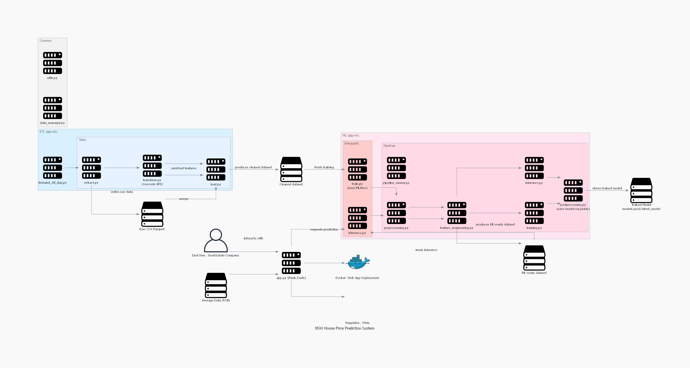

# 🏠 NSW House Price Prediction System

## Overview
This project predicts house prices in New South Wales (NSW) and provides summary insights such as:

- Summary statistics of numeric features  
- Distribution plots for selected features  
- Average values by postcode  
- Scatterplots of price vs selected features  

It is designed for both normal users exploring house prices and real estate companies for decision support.

---

## 🚀 Features

- **Price Prediction:** Predict house prices using XGBoost  
- **Data Analysis:** Explore distributions, summary statistics, and feature correlations  
- **Postcode Insights:** Average numeric values for each postcode  
- **Interactive UI:** Visualize predictions and feature analysis in an easy-to-use dashboard  

---

## 📁 Project Workflow



---

## ⚙️ Pipelines

### 1. ETL Pipeline
- **Extract:** Scrape raw housing data from web sources  
- **Transform:** Clean and preprocess data  
- **Load:** Save cleaned data for modeling  

### 2. ML Pipeline
- **Preprocessing:** Handle missing values, convert dtypes, and clean data  
- **Feature Engineering:** Create derived features like `price_per_m2`, `distance_to_city`, and postcode averages  
- **Training:** Train XGBoost model  
- **Inference:** Make batch or real-time predictions  
- **Postprocessing:** Format outputs and store predictions  

---

## 🚀 Quick Start

### Option 1: Running Application in Docker (Recommended)

```bash
# Clone the repository
git clone <your-repo-url>
cd house-price-prediction

# Deploy all services with production configuration
docker-compose up --build

# Verify service health
docker-compose ps
docker-compose logs -f

# Access the application
# 🌐 UI Dashboard: http://localhost:8050
# 🔌 Inference API: http://localhost:5001/health
```

**Expected Output:**
```
✅ app-ml-train         Up
✅ app-ml-inference-api Up  
✅ app-ui              Up
```

### Option 2: Running Application Locally

```bash
# Clone the repository
git clone <your-repo-url>
cd house-price-prediction


# Train the model first (if not already trained)
python app-ml/entrypoint/rain.py

# Run inference in a loop 
python app-ml/entrypoint/inference.py

# Start the inference API tomlink to the application UI
python app-ml/entrypoint/inference_api.py

# Start the UI dashboard in another terminal
cd app-ui
python app.py
```

## 📁 Project Architecture & Data Flow
```text
├── .env
├── Dockerfile
├── app-etl
│   ├── dags
│   │   └── demand_etl_dag.py
│   └── tasks
│       ├── extract.py
│       ├── load.py
│       └── transform.py
├── app-ml
│   ├── entrypoint
│   │   ├── inference.py
│   │   └── train.py
│   └── src
│       ├── __init__.py
│       ├── pipelines
│       │   ├── feature_engineering.py
│       │   ├── inference.py
│       │   ├── pipeline_runner.py
│       │   ├── postprocessing.py
│       │   ├── preprocessing.py
│       │   └── training.py
│       └── test
├── app.py
├── common
│   ├── __init__.py
│   ├── data_manager.py
│   └── utils.py
├── config
│   └── config.yaml
├── data
│   ├── avg
│   │   └── avg_info.json
│   ├── cleaned
│   │   ├── old_cleaned.parquet
│   │   └── year=2025
│   │       └── month=09
│   │           ├── day=06
│   │           │   ├── database_cleaned_20250906.csv
│   │           │   └── database_cleaned_20250906.parquet
│   │           └── day=08
│   │               ├── database_cleaned_20250908.csv
│   │               └── database_cleaned_20250908.parquet
│   ├── ml-ready
│   │   ├── database_ml.parquet
│   │   ├── old_cleaned_data.parquet
│   │   └── testt.py
│   ├── raw
│   │   └── year=2025
│   │       └── month=09
│   │           ├── day=06
│   │           │   ├── database_20250906.parquet
│   │           │   └── geocode_partial.csv
│   │           └── day=08
│   │               ├── database_20250908.parquet
│   │               └── geocode_partial.csv
│   └── test
│       ├── Test.csv
│       ├── Test.parquet
│       ├── geocode_partial.csv
│       └── testt.py
├── models
│   └── prod
│       └── latest_model
├── readme.md
├── requirements.txt
├── templates
│   ├── analysis.html
│   ├── home.html
│   └── prediction.html
```

## 📊 Data & Insights

- **Summary Statistics**  
  Provides mean, median, standard deviation, minimum, and maximum values for numeric features.

- **Feature Distribution**  
  Visualizes feature distributions using histograms and Kernel Density Estimation (KDE) plots.

- **Postcode Insights**  
  Computes and presents average numeric values for each postcode.

- **Scatter Plots**  
  Shows price versus feature relationships for deeper analysis and correlation.

---

## 📜 License

This project is licensed for **personal and educational use only**.

- **✅ Free** to explore, fork, and modify for learning purposes.  
- **❌ Not allowed** for commercial use without explicit permission.
